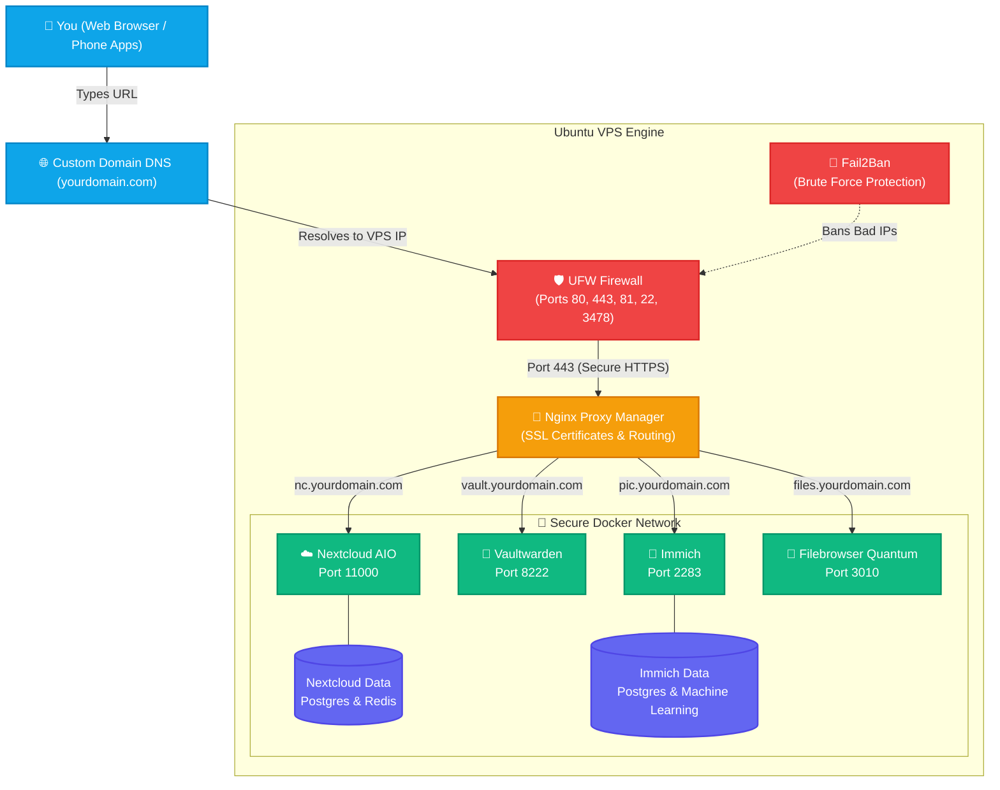

🚀 Self-Hosted VPS HomeLab Architecture

Welcome to the complete self-hosted ecosystem! This guide contains the architecture, automated deployment scripts, and deployment timeline for a secure, containerized Ubuntu VPS. This setup replaces Google Drive, Google Photos, Bitwarden, and provides a blazing-fast root-level file manager.
🗺️ Architecture DiagramBelow is the visual map of how the server operates, showing traffic flow from the outside internet (using a custom domain), through the security layers and Nginx Proxy Manager, down to the individual Docker containers.(Note: If you copy/paste this code block into a Mermaid Live Editor or GitHub, it will instantly generate the visual diagram!)

🗺️ The Setup Timeline (How To Build It)Here is the exact chronological order of how to engineer this machine from a fresh installation:Phase 1: The Foundation & SecurityProvision VPS: Spin up a fresh Ubuntu 22.04 or 24.04 machine.UFW Firewall: Lock down the server so only specific doors are open (22, 80, 443, 81, 3478).Fail2Ban: Install a security guard tailored for Docker that watches logs and permanently blocks any IP address exhibiting malicious behavior or scanning.Phase 2: The Core InfrastructureDocker: Install the Docker engine to act as the containerized operating system.Nginx Proxy Manager (NPM): Deploy the "Traffic Cop" on ports 80 and 443. NPM catches all incoming traffic, checks the subdomain, applies a free Let's Encrypt SSL certificate, and securely routes it to the right app.Phase 3: The Application LayerNextcloud AIO: Deploy the master container on port 8080, which then automatically downloads and configures Apache, PostgreSQL, Redis, and Nextcloud Talk.Vaultwarden: Deploy the lightweight Rust port of Bitwarden, enabling Websockets for real-time password syncing to browser extensions.Immich: Deploy the high-performance Google Photos replacement, complete with a dedicated Postgres database, Redis cache, and Machine Learning container for facial recognition.FileBrowser Quantum: Deploy a blazing-fast web-based file manager fork with a modern UI. Mapped directly to the host OS root directory (/) to provide full administrative file access via the web UI.🛠️ The Automated Deployment ScriptsBelow are the bash scripts used to deploy the environment. You can deploy these by creating .sh files on your Ubuntu server, pasting the code below into them, and running them via bash filename.sh.Note: These scripts are fully interactive. They will ask you for your IP address and custom domains, and adapt the instructions on the fly.1. Core Infrastructure & Nextcloud (The Master Script)Sets up System Updates, Docker, UFW Firewall, Fail2ban, Nginx Proxy Manager, and Nextcloud AIO.

<b>Click to expand <code>nc-master-install.sh</code></b>
#!/bin/bash

clear
echo "================================================================="
echo "   ULTIMATE NEXTCLOUD AIO + NPM + SECURITY INSTALLER             "
echo "================================================================="
echo ""
echo "Before we begin, I need some information about your setup:"
read -p "1. Enter your VPS Public IP Address (e.g., 45.137.x.x): " VPS_IP
read -p "2. Enter your intended Nextcloud Subdomain (e.g., nc.yourdomain.com): " DOMAIN
read -p "3. Enter your 2-letter Country Code (e.g., US, UK, DE): " COUNTRY_CODE
echo ""
echo "Thank you! Starting automated deployment for $DOMAIN..."
sleep 3

# ==========================================
# Phase 1: System Updates & Docker
# ==========================================
echo -e "\n---> [1/8] Updating System & Installing Docker..."
export DEBIAN_FRONTEND=noninteractive
sudo apt-get update && sudo apt-get upgrade -y
sudo apt-get install -y ca-certificates curl gnupg ufw fail2ban iptables
curl -fsSL [https://get.docker.com](https://get.docker.com) -o get-docker.sh
sudo sh get-docker.sh

# ==========================================
# Phase 2: Firewall Setup (UFW & Iptables)
# ==========================================
echo -e "\n---> [2/8] Configuring UFW Firewall and Iptables..."
sudo ufw default deny incoming
sudo ufw default allow outgoing
sudo ufw allow 22/tcp      # SSH
sudo ufw allow 80/tcp      # HTTP
sudo ufw allow 443/tcp     # HTTPS
sudo ufw allow 81/tcp      # NPM Admin
sudo ufw allow 8080/tcp    # Nextcloud AIO Setup
sudo ufw allow 3478/tcp    # Nextcloud Talk (TCP)
sudo ufw allow 3478/udp    # Nextcloud Talk (UDP)
sudo ufw --force enable

sudo iptables -I INPUT -p tcp --dport 3478 -j ACCEPT
sudo iptables -I INPUT -p udp --dport 3478 -j ACCEPT

# ==========================================
# Phase 3: Nginx Proxy Manager (NPM)
# ==========================================
echo -e "\n---> [3/8] Deploying Nginx Proxy Manager..."
mkdir -p ~/npm && cd ~/npm

cat << EOF > docker-compose.yml
services:
  npm:
    image: 'jc21/nginx-proxy-manager:latest'
    container_name: npm
    restart: unless-stopped
    ports:
      - '80:80'
      - '81:81'
      - '443:443'
    volumes:
      - ./data:/data
      - ./letsencrypt:/etc/letsencrypt
EOF

sudo docker compose up -d

# ==========================================
# Phase 4: Pause for NPM Configuration
# ==========================================
echo ""
echo "=========================================================================="
echo " PAUSE 1: NGINX PROXY MANAGER & SSL SETUP                                 "
echo "=========================================================================="
echo "1. Go to: http://$VPS_IP:81"
echo "2. Log in with: admin@example.com / changeme"
echo "3. Add a Let's Encrypt Certificate for $DOMAIN."
echo "   (Make sure your A Record for $DOMAIN points to $VPS_IP first!)"
echo "4. Create Proxy Host for $DOMAIN -> $VPS_IP:11000 (Enable Websockets)."
echo "=========================================================================="
read -p "Press [Enter] ONLY AFTER you have saved the Proxy Host in NPM..."

# ==========================================
# Phase 5: Nextcloud AIO Master Container
# ==========================================
echo -e "\n---> [5/8] Deploying Nextcloud AIO Master Container..."
mkdir -p ~/nextcloud-aio && cd ~/nextcloud-aio

cat << EOF > docker-compose.yml
services:
  nextcloud-aio-mastercontainer:
    image: nextcloud/all-in-one:latest
    init: true
    restart: always
    container_name: nextcloud-aio-mastercontainer
    volumes:
      - nextcloud_aio_mastercontainer:/mnt/docker-aio-config
      - /var/run/docker.sock:/var/run/docker.sock:ro
    ports:
      - 8080:8080
    environment:
      - APACHE_PORT=11000
      - APACHE_IP_BINDING=0.0.0.0
volumes:
  nextcloud_aio_mastercontainer:
    name: nextcloud_aio_mastercontainer
EOF

sudo docker compose up -d

# ==========================================
# Phase 6: Pause for Nextcloud Web Setup
# ==========================================
echo ""
echo "=========================================================================="
echo " PAUSE 2: NEXTCLOUD AIO INITIALIZATION                                    "
echo "=========================================================================="
echo "1. Go to: https://$DOMAIN:8080"
echo "2. Enter your domain: $DOMAIN and start containers."
echo "CRITICAL: Wait until the screen says 'Initial setup is complete'."
echo "=========================================================================="
read -p "Press [Enter] ONLY AFTER Nextcloud is fully installed and running..."

# ==========================================
# Phase 7: Post-Install OCC Fixes
# ==========================================
echo -e "\n---> [7/8] Applying Nextcloud Region & Mimetype Fixes..."
sudo docker exec --user www-data nextcloud-aio-nextcloud php occ config:system:set default_phone_region --value="$COUNTRY_CODE"
sudo docker exec --user www-data nextcloud-aio-nextcloud php occ maintenance:repair --include-expensive

# ==========================================
# Phase 8: Fail2ban & Docker Security
# ==========================================
echo -e "\n---> [8/8] Configuring Docker-Aware Fail2ban..."

cat << 'EOF' | sudo tee /etc/fail2ban/action.d/docker-action.conf
[Definition]
actionstart = iptables -N f2b-<name>
              iptables -A f2b-<name> -j RETURN
              iptables -I INPUT -j f2b-<name>
              iptables -I DOCKER-USER -j f2b-<name>
actionstop = iptables -D DOCKER-USER -j f2b-<name>
             iptables -D INPUT -j f2b-<name>
             iptables -F f2b-<name>
             iptables -X f2b-<name>
actioncheck = iptables -n -L INPUT | grep -q 'f2b-<name>[ \t]'
actionban = iptables -I f2b-<name> 1 -s <ip> -j DROP
actionunban = iptables -D f2b-<name> -s <ip> -j DROP
EOF

cat << 'EOF' | sudo tee /etc/fail2ban/filter.d/npm-docker.conf
[Definition]
failregex = ^<HOST> .+ "(GET|POST|HEAD) .+ HTTP/.*" (400|401|403|404|444) .+$
ignoreregex =
EOF

cat << 'EOF' | sudo tee /etc/fail2ban/jail.local
[DEFAULT]
bantime = 86400
findtime = 600
maxretry = 3
banaction = docker-action

[sshd]
enabled = true
port = ssh
filter = sshd
logpath = /var/log/auth.log
maxretry = 3

[npm-docker]
enabled = true
port = http,https
filter = npm-docker
logpath = /root/npm/data/logs/proxy-host-*_access.log
maxretry = 15
EOF

sudo systemctl enable fail2ban
sudo systemctl restart fail2ban

echo "=========================================================================="
echo "                        INSTALLATION COMPLETE!                            "
echo "=========================================================================="

2. Vaultwarden & ImmichDeploys the password manager and Google Photos alternative.

<b>Click to expand <code>install-extras.sh</code></b>
#!/bin/bash

echo "======================================================="
echo "   DEPLOYING VAULTWARDEN (Password Manager)            "
echo "======================================================="
mkdir -p ~/vaultwarden
cd ~/vaultwarden

# Create Vaultwarden docker-compose file
cat << 'EOF' > docker-compose.yml
services:
  vaultwarden:
    image: vaultwarden/server:latest
    container_name: vaultwarden
    restart: always
    environment:
      - WEBSOCKET_ENABLED=true # Required for live syncing to browser extensions
    volumes:
      - ./vw-data:/data
    ports:
      - "8222:80"
EOF

sudo docker compose up -d

echo ""
echo "======================================================="
echo "   DEPLOYING IMMICH (Self-Hosted Photo Backup)         "
echo "======================================================="
mkdir -p ~/immich
cd ~/immich

echo "Downloading official Immich configuration files..."
wget -q -O docker-compose.yml [https://github.com/immich-app/immich/releases/latest/download/docker-compose.yml](https://github.com/immich-app/immich/releases/latest/download/docker-compose.yml)
wget -q -O .env [https://github.com/immich-app/immich/releases/latest/download/example.env](https://github.com/immich-app/immich/releases/latest/download/example.env)

# Configure the .env file automatically
sed -i 's|UPLOAD_LOCATION=.*|UPLOAD_LOCATION=./immich-data|g' .env
DB_PASS=$(openssl rand -hex 16)
sed -i "s|DB_PASSWORD=.*|DB_PASSWORD=$DB_PASS|g" .env
# Change this timezone to your local timezone if needed
sed -i 's|TZ=Etc/UTC|TZ=America/Los_Angeles|g' .env

sudo docker compose up -d

echo ""
echo "======================================================="
echo "   EXTRA SERVICES ARE NOW RUNNING!                     "
echo "======================================================="
echo "Vaultwarden Internal Port: 8222"
echo "Immich Internal Port: 2283"
echo "Proxy these ports in Nginx Proxy Manager to your subdomains!"

3. FileBrowser Quantum (Root Access)The modernized FileBrowser fork. Maps directly to your server root (/) for total administration control.

<b>Click to expand <code>install-filebrowser.sh</code></b>
#!/bin/bash

clear
echo "======================================================="
echo "   DEPLOYING FILEBROWSER QUANTUM (Root File Manager)   "
echo "======================================================="
echo "WARNING: This container will have access to your ENTIRE"
echo "VPS root filesystem. Use a strong password!"
echo "======================================================="
echo ""
read -p "Enter your intended subdomain (e.g., files.yourdomain.com): " FB_DOMAIN
echo ""
echo "Please check [https://filebrowserquantum.com/en/](https://filebrowserquantum.com/en/) for the official"
echo "Docker image name (e.g., ghcr.io/username/filebrowser-quantum:latest)."
read -p "Enter the exact Docker image name: " FB_IMAGE

if [ -z "$FB_IMAGE" ]; then
    echo "Error: Image name cannot be empty. Aborting."
    exit 1
fi

mkdir -p ~/filebrowser
cd ~/filebrowser

# Clean up previous deployments if any
echo "Cleaning up any existing containers..."
sudo docker stop filebrowser-quantum 2>/dev/null || true
sudo docker rm filebrowser-quantum 2>/dev/null || true

# Pre-create the database file so Docker doesn't 
# accidentally create it as a directory
touch filebrowser.db

# Create the Docker Compose configuration using the Quantum image
echo "Creating Docker Compose configuration..."
cat << EOF > docker-compose.yml
services:
  filebrowser:
    image: $FB_IMAGE
    container_name: filebrowser-quantum
    restart: unless-stopped
    # We must run this as root inside the container so it has 
    # permission to read/write to your host's root folders
    user: "0:0"
    ports:
      - "3010:80"
    volumes:
      # THE MAGIC LINE: Maps the Host OS Root to /srv inside Filebrowser
      - /:/srv
      # Map the database file for persistence
      - ./filebrowser.db:/database/filebrowser.db
    environment:
      - FB_DATABASE=/database/filebrowser.db
EOF

# Start the container
echo "Starting FileBrowser Quantum container..."
sudo docker compose up -d

echo ""
echo "======================================================="
echo "   FILEBROWSER QUANTUM IS NOW BOOTING UP!              "
echo "======================================================="
echo "FileBrowser Quantum is listening internally on port: 3010"
echo ""
echo "Next Step: Add it to Nginx Proxy Manager!"
echo "1. Go to your Nginx Proxy Manager dashboard (:81)"
echo "2. Create a Proxy Host for: $FB_DOMAIN"
echo "3. Forward it to port: 3010"
echo "4. Under 'Details', ensure 'Websockets Support' is ENABLED"
echo "5. Under 'SSL', ensure 'Force SSL' is ENABLED"
echo ""
echo "Once saved, visit https://$FB_DOMAIN"
echo "Default Login: admin / admin"
echo "CRITICAL: Change your password immediately after logging in!"
echo "======================================================="

4. The Cleanup "Nuke" ScriptSafely wipes your core Docker environment (Nextcloud/NPM) without reformatting the OS.

<b>Click to expand <code>uninstall-core.sh</code></b>
#!/bin/bash

clear
echo "================================================================="
echo "   DANGER: TOTAL NEXTCLOUD & NPM ANNIHILATION SCRIPT             "
echo "================================================================="
echo "This script will PERMANENTLY DELETE:"
echo " - All Nextcloud AIO containers and data"
echo " - Nginx Proxy Manager (NPM) containers and data"
echo " - All unused Docker Volumes and Images"
echo " - The custom Fail2ban security configurations"
echo " - The ~/npm and ~/nextcloud-aio directories"
echo "================================================================="
read -p "Are you ABSOLUTELY sure you want to wipe everything? (Type YES to continue): " CONFIRM

if [ "$CONFIRM" != "YES" ]; then
    echo "Aborting. Nothing was deleted."
    exit 1
fi

echo -e "\n---> [1/5] Stopping Nextcloud and NPM Containers..."
sudo docker stop $(sudo docker ps -a -q --filter name=nextcloud --filter name=npm) 2>/dev/null || true

echo -e "\n---> [2/5] Removing Containers and Networks..."
sudo docker rm $(sudo docker ps -a -q --filter name=nextcloud --filter name=npm) 2>/dev/null || true
sudo docker container prune -f
sudo docker network rm nextcloud-aio 2>/dev/null || true

echo -e "\n---> [3/5] Nuking Docker Volumes and Images..."
sudo docker volume prune -f --filter all=1
sudo docker image prune -a -f

echo -e "\n---> [4/5] Deleting Physical Data Directories..."
sudo rm -rf ~/npm
sudo rm -rf ~/nextcloud-aio

echo -e "\n---> [5/5] Reverting Fail2ban Security Configs..."
sudo rm -f /etc/fail2ban/action.d/docker-action.conf
sudo rm -f /etc/fail2ban/filter.d/npm-docker.conf
sudo rm -f /etc/fail2ban/jail.local
sudo systemctl restart fail2ban 2>/dev/null || true

echo ""
echo "================================================================="
echo "   CLEANUP COMPLETE!                                             "
echo "================================================================="

