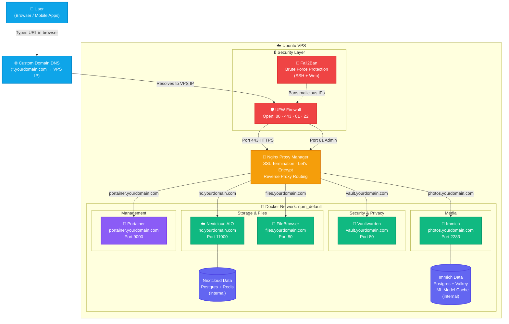

# VPS Homelab Stack — Architecture & Traffic Flow

A self-hosted homelab running on Ubuntu VPS with Docker containers behind Nginx Proxy Manager. All services are accessible via secure HTTPS subdomains — no service is directly exposed to the internet.

---

## Architecture Diagram

The diagram below shows how traffic flows from the outside internet through the security layers, through Nginx Proxy Manager, and down to each individual Docker container.



---

## How It Works

| Layer | Component | Role |
|-------|-----------|------|
| **DNS** | Your domain registrar | Wildcard A record `*.yourdomain.com` points to VPS IP |
| **Firewall** | UFW | Only ports 22, 80, 443, 81 open — everything else blocked |
| **Brute Force** | Fail2Ban | Auto-bans IPs that fail SSH or web login repeatedly |
| **Proxy / SSL** | Nginx Proxy Manager | Routes subdomains to containers, manages Let's Encrypt certs |
| **Containers** | Docker (`npm_default`) | All services run isolated, only reachable through NPM |

---

## Services

| Service | Subdomain | Purpose |
|---------|-----------|---------|
| **Nginx Proxy Manager** | `npm.yourdomain.com` | SSL gateway and routing hub — admin panel |
| **Nextcloud AIO** | `nc.yourdomain.com` | Self-hosted Google Drive — files, calendar, contacts |
| **Vaultwarden** | `vault.yourdomain.com` | Self-hosted Bitwarden — password manager |
| **Immich** | `photos.yourdomain.com` | Self-hosted Google Photos — photo & video backup |
| **FileBrowser** | `files.yourdomain.com` | Web-based file manager for your VPS storage |
| **Portainer** | `portainer.yourdomain.com` | Docker container management dashboard |

---

## The Golden Rule

Every container joins the `npm_default` Docker network and uses `expose:` (never `ports:`).
NPM is the only entry point from the internet — no container is directly reachable externally.

```yaml
networks:
  npm_net:
    external: true
    name: npm_default   # must be this exact name
```

---

## Quick Deploy

```bash
bash <(curl -fsSL https://raw.githubusercontent.com/ulyweb/vps/refs/heads/main/community/vps-community-install.sh)
```

> Requires Ubuntu 22.04 / 24.04 · Non-root sudo user · DNS records pointing to your VPS IP
